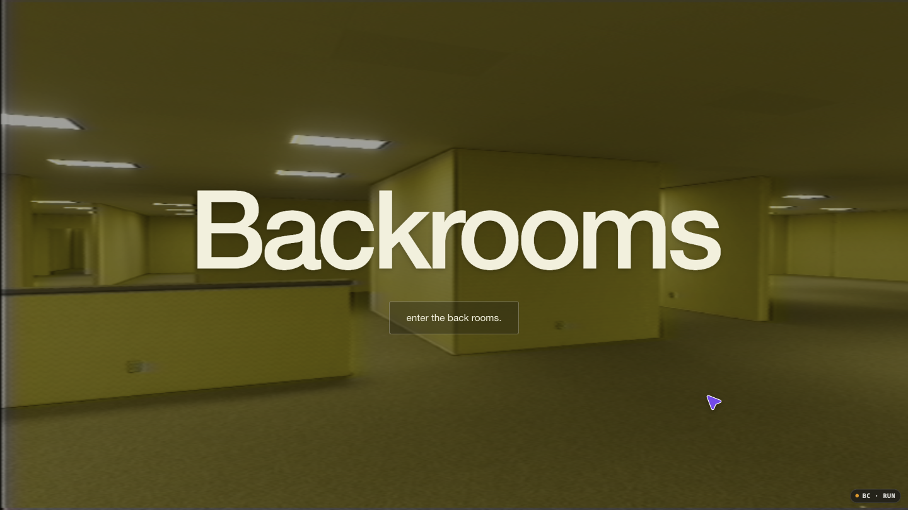
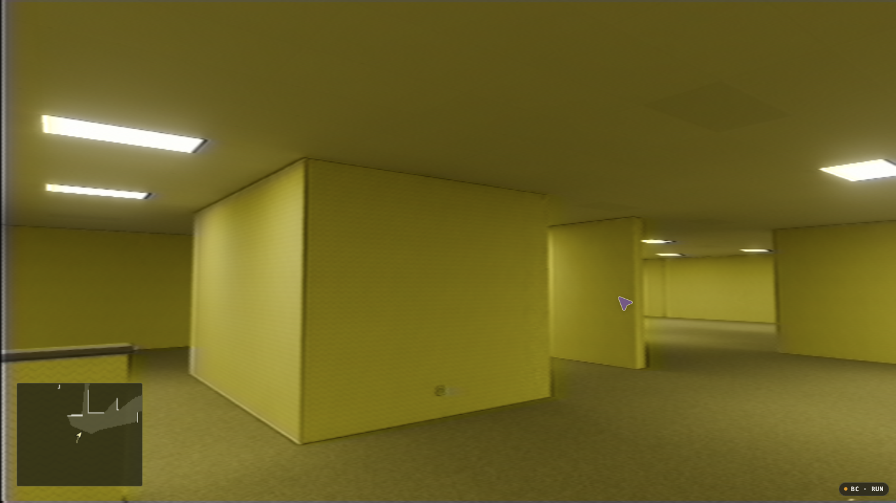
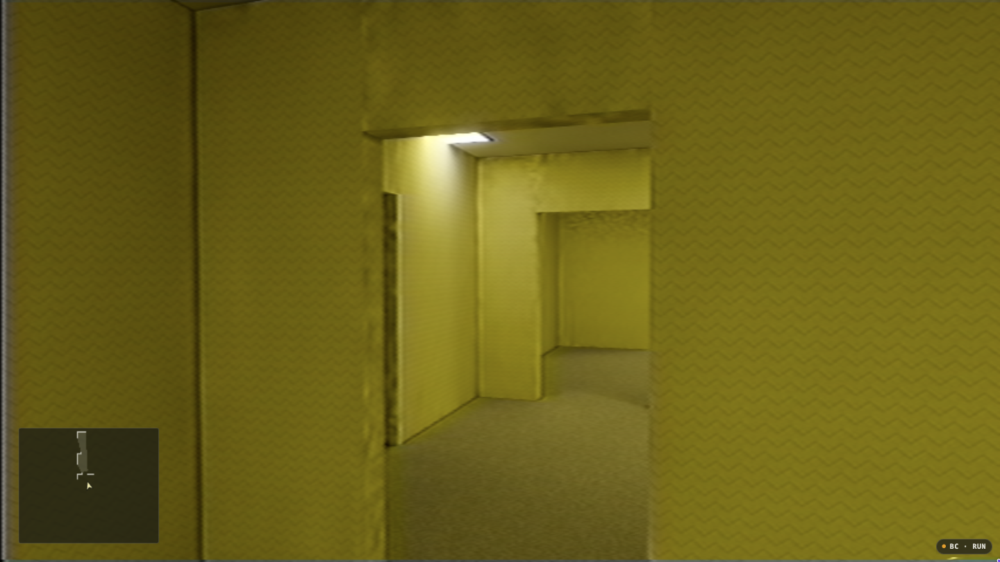
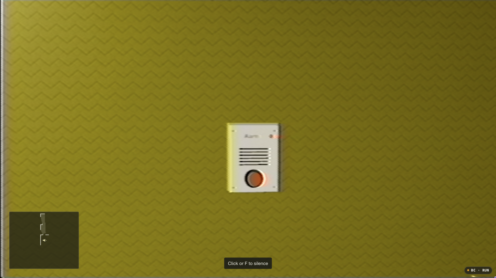

# Browserooms

**[Play in your browser](https://backrooms.exe.xyz/)**



A first-person Backrooms exploration game for the browser, built with Three.js, Blender-baked lighting, and real ntsc-rs VHS processing. The horror comes from empty rooms, distant footsteps, unreliable lights, and alarms you have to find and silence. No creatures or jump scares.

## Explore

- **Changing architecture.** Open spaces lead into medium-room suites and tighter rooms with narrow doorways, dead ends, and occasional larger spaces. Seeded regions stay consistent when you backtrack.
- **A handheld camcorder.** Hold-to-zoom lens controls, mechanical zoom sounds, and selectable VHS presets. Walking and standing motion can be fixed or react to tension.
- **Unreliable lights.** Fixtures flicker, nearby circuits go dark, and watched flickering lights settle back to normal.
- **Sound you can follow.** Heavy steps behind you, an adaptive soundtrack, and wall-mounted alarms that grow louder until you silence them.
- **An exploration map.** A compact minimap reveals visible areas and traces your route without exposing the whole layout.

| Open rooms | Enclosed rooms |
| --- | --- |
|  |  |



## Run locally

Install [Bun](https://bun.sh), then:

```sh
git clone https://github.com/R44VC0RP/browserooms.git
cd browserooms
bun install
bun run dev
```

Open **http://127.0.0.1:5177/** and enter the Backrooms. The entry button also unlocks audio if your browser blocks autoplay.

The baked scenes, textures, audio, and VHS runtime are included. Blender is not required to play.

## Controls

| Input | Action |
| --- | --- |
| WASD or arrow keys | Move |
| Shift | Run |
| Mouse | Look around; drag if pointer lock is unavailable |
| Hold Q / E | Zoom in / out |
| Click an alarm, or aim at it and press F | Silence it when within reach |
| M | Toggle sound |
| Escape | Pause and access Image settings |

On touchscreens, use the stick to move, drag to look, tap an alarm to silence it, and use Menu to pause.

Image settings includes VHS presets and separate walking and standing camera-motion styles. Reactive motion becomes less steady as tension rises; Off removes the added movement.

## Build

```sh
bun run build
```

The production output goes into `dist/`.

The live game is hosted on exe.dev, with Nginx serving the production build on port 8000 behind its public HTTPS proxy. The server configuration is in [`deploy/nginx.conf`](deploy/nginx.conf).

Gameplay and rendering live in `src/`, runtime assets in `public/`, Blender source scenes in `assets/`, and asset-generation scripts in `scripts/`. VHS processing uses [ntsc-rs](https://github.com/ntsc-rs/ntsc-rs) compiled to WebAssembly; its [build provenance and notices](src/vendor/ntsc-rs/README.md) are included.
